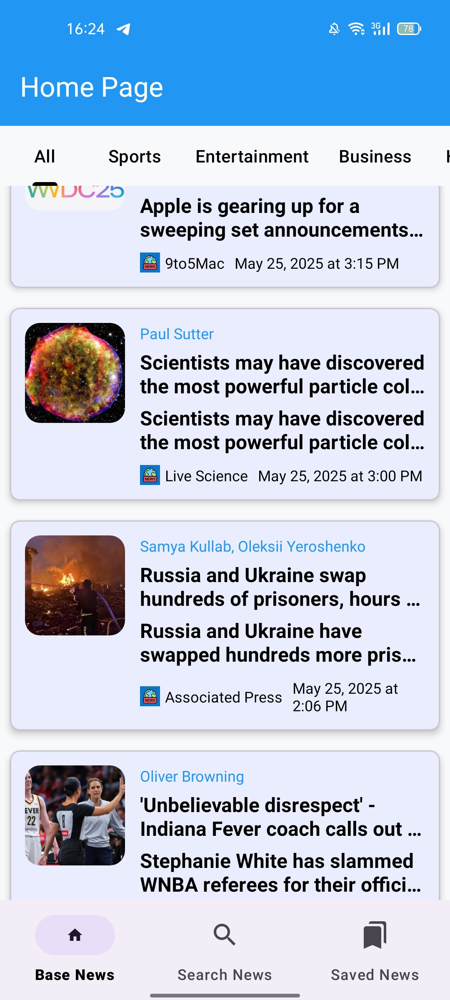
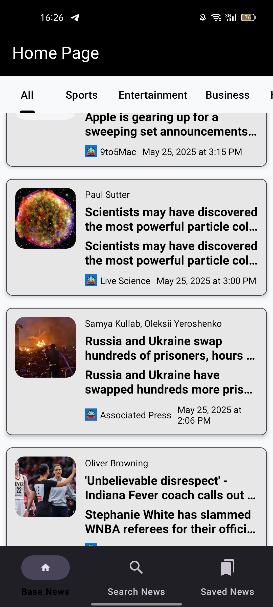
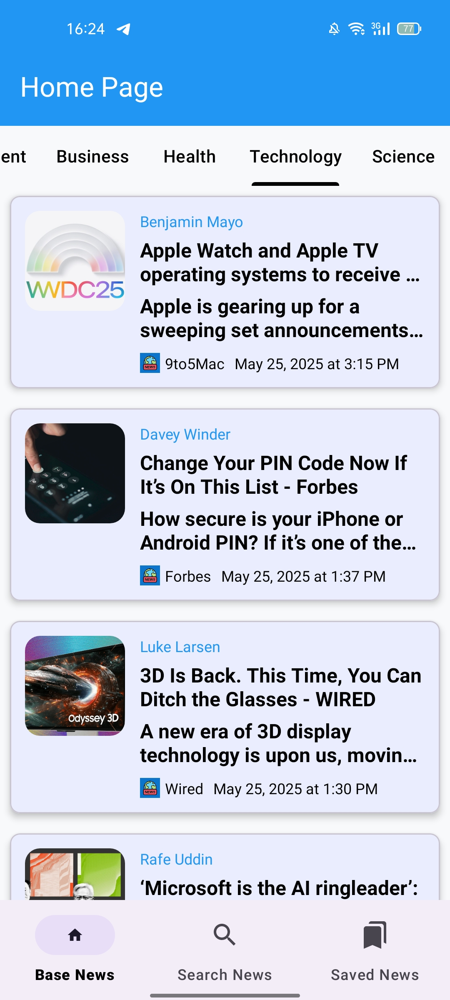
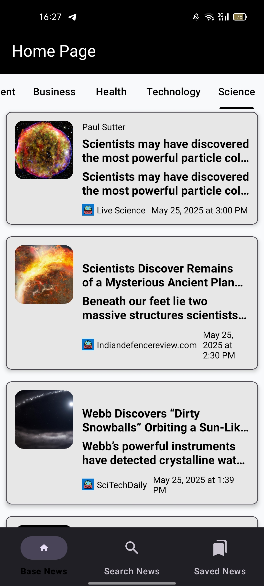
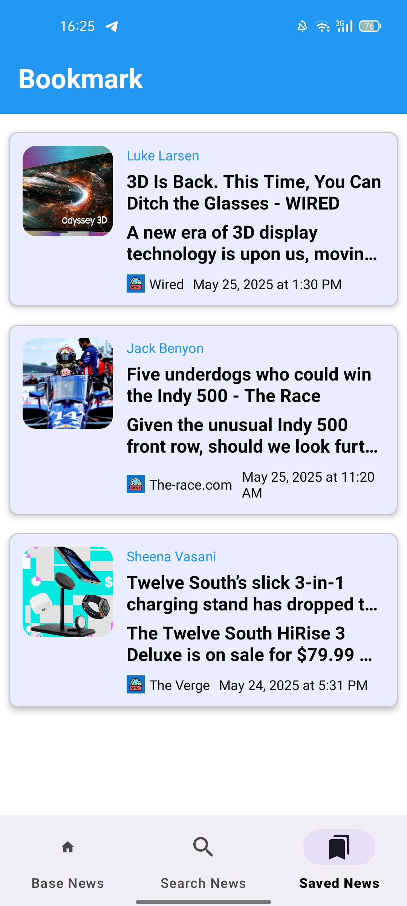
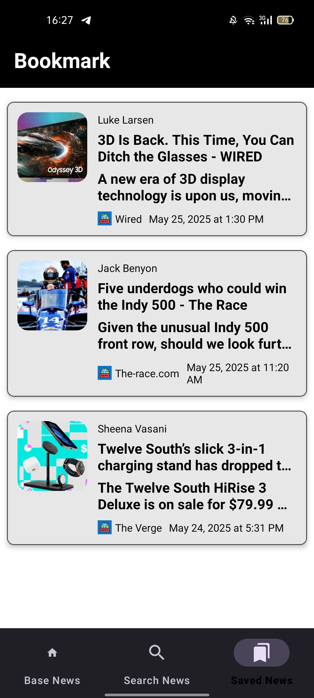
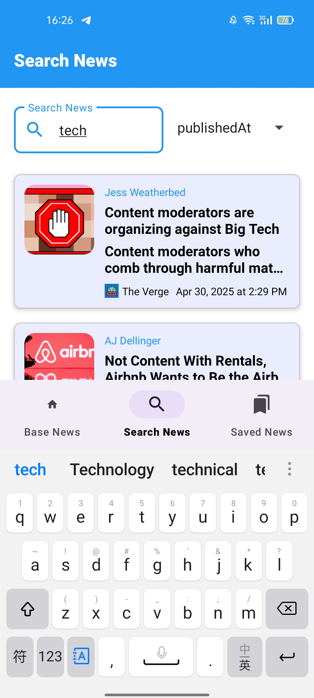
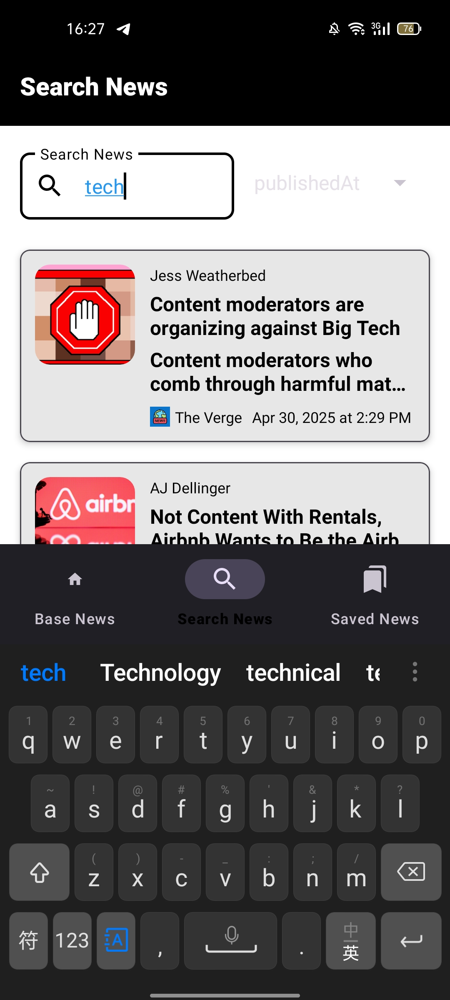
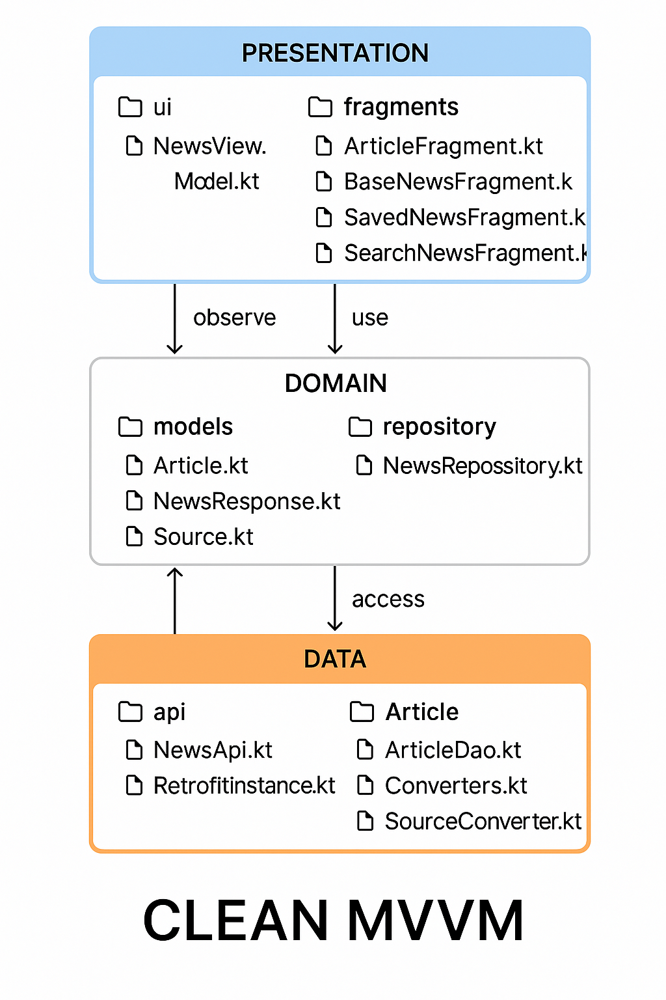

# NewsApp

> This project is currently a 🚧 **work in progress**.

**NewsApp** is a modern Android application that fetches and displays the latest news from the [News API](https://newsapi.org/). 
Built with Kotlin , it follows the principles of Modern Android Development (MAD) and showcases best practices in architecture, UI design, and data handling.

## Screenshots
### splash screen
 


### Home screen
 

### Category screen
 


### Bookmark screen
 


### Search screen 

 


# Set up Requirements 
Obtain your key from [News API](https://newsapi.org/) and replace it in the local.properties file


```gradle
    API_KEY=API_KEY_VALUE
```
      
## Build and Run NewsApp

1. Clone the repository:
   ```bash
   git clone https://github.com/isaacjayden24/NewsApp.git
   
2. Open the project in Android Studio.

3. Sync the Gradle files and run the app module


## 🔧  Built with

- **Language:** Kotlin
- **Architecture:** MVVM (Model-View-ViewModel)
- **UI Framework:**  XML + Material Design
- **Networking:** Retrofit
- **Persistence:** Room Database
- **Asynchronous Tasks:** Kotlin Coroutines
- **Navigation:** Navigation Component

## ✨ Features

- 🔄 **Real-time News Fetching**  
  Fetches the latest news from the [News API](https://newsapi.org/) to keep users up to date.

- 📜 **Top Headlines with Smooth Pagination**  
  Browse top headlines with infinite scroll for a seamless experience.

- 💾 **Offline Reading Support**  
  Save your favorite articles locally to read them later without internet access.

- 🎨 **Responsive UI with Material Design**  
  Modern and clean interface built using Material Design components.


- 🔀 **Seamless Screen Navigation**  
  Smooth transitions and navigation between screens using Android Navigation components.

- 🔍 **Search Functionality**   
  Easily find news articles based on keywords and queries.

- 🗂️ **Category Filtering**  
  Filter articles based on categories like Technology, Health, Sports, etc.


##  Architecture



##  Contributing
Contributions are welcome! Feel free to fork the repo, open issues, and submit pull requests


